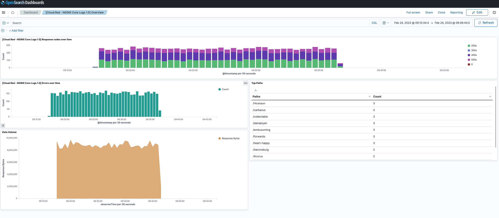

# Nginx Dashboard Playground
For the purpose of playing and reviewing the nginx dashboard, this tutorial uses the nginx preloaded access-logs data. This sample data was generated using nginx fluent-bit data generator repo and translated it using the
fluent-bit nginx lua parser - that appears in the test mention below.
- [Fluent-bit](https://github.com/fluent/fluent-bit)
- [Services Playground](../../test/README.md)

The [sample logs](bulk_logs.json) are added here under the preloaded data folder and are ready to be ingested into open search.

## Demo Instructions

1. Start docker-compose docker compose up --build.
This will load both opensearch server & dashboards   
   - `$ docker compose up`
   - Ensure vm.max_map_count has been set to 262144 or higher (`sudo sysctl -w vm.max_map_count=262144`).
   
2. Load the Simple Schema Logs index templates [Loading Logs](../../../../schema/observability/logs/Usage.md)
    
   - `curl -XPUT localhost:9200/_component_template/http_template  -H "Content-Type: application/json" --data-binary @http.mapping`
   
   - `curl -XPUT localhost:9200/_component_template/communication_template  -H "Content-Type: application/json" --data-binary @communication.mapping`
   
   - `curl -XPUT localhost:9200/_index_template/logs  -H "Content-Type: application/json" --data-binary @logs.mapping`
3. Bulk load the Nginx access logs preloaded data into the `sso_logs-nginx-prod` data_stream
   - `curl -XPOST "localhost:9200/sso_logs-nginx-prod/_bulk?pretty&refresh" -H "Content-Type: application/json" --data-binary @bulk_logs.json`
   
4. We can now load the Nginx dashboards to display the preloaded nginx access logs [dashboards](../../assets/display/sso-logs-dashboard.ndjson)
   - First add an index pattern `sso_logs-*-*`
     - `curl  -X POST localhost:5601/api/saved_objects/index-pattern/sso_logs -H 'osd-xsrf: true'  -H 'Content-Type: application/json' -d '{ "attributes": { "title": "sso_logs-*-*",  "timeFieldName": "@timestamp" } }'`
   
   - Load the [dashboards](../../assets/display/sso-logs-dashboard.ndjson) 
     - `curl -X POST "localhost:5601/api/saved_objects/_import?overwrite=true" -H "osd-xsrf: true" --form file=@sso-logs-dashboard.ndjson`
5. Open the dashboard and view the preloaded access logs
   - Go to [Dashbords](http://localhost:5601/app/dashboards#/list?_g=(filters:!(),refreshInterval:(pause:!t,value:0),time:(from:'2023-02-24T17:10:34.442Z',to:'2023-02-24T17:46:44.056Z'))
   
   
